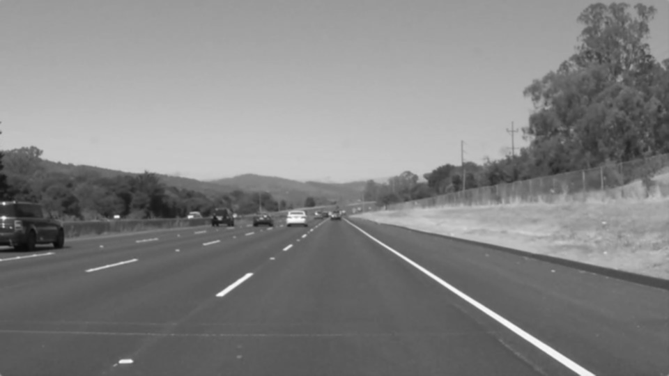

# **Finding Lane Lines on the Road** 

---

### The goals / steps of this project are the following:
* Make a pipeline that finds lane lines on the road
* Reflect on your work in a written report

##### Report is prepared and submitted by Abeer Ghander
---

## Reflection

### 1. Describe your pipeline. As part of the description, explain how you modified the draw_lines() function.

#### **My pipeline consisted of 7 steps:**

Let us take those two original images for our pipelines explanation..
<figure>
 
 <figcaption>
     <p style="text-align: center;"> Original solidWhiteRight image </p>
     <p/>
 </figcaption>
    
 
 <figcaption>
     <p style="text-align: center;"> Original solidYellowCurve image </p>
 </figcaption>
</figure>

First, I converted the images to grayscale.

<figure>
 
 <figcaption>
     <p style="text-align: center;"> Gray scaled solidWhiteRight image </p>
     <p/>
 </figcaption>
    
 
 <figcaption>
     <p style="text-align: center;"> Gray scaled solidYellowCurve image </p>
 </figcaption>
</figure>

Second, I applied Gaussian blurring on the grayscale image with `kernel = 3`.

<figure>
 
 <figcaption>
     <p style="text-align: center;"> Gaussian solidWhiteRight image </p>
     <p/>
 </figcaption>
    
 
 <figcaption>
     <p style="text-align: center;"> Gaussian solidYellowCurve image </p>
 </figcaption>
</figure>

Third, I extracted the canny edges from the gaussian blurred image. Canny transformation is applied with the `min_threshold = 50`, and `max_threshold = 150`
<figure>
 
 <figcaption>
     <p style="text-align: center;"> Canny edges solidWhiteRight image </p>
     <p/>
 </figcaption>
    
 
 <figcaption>
     <p style="text-align: center;"> Canny edges solidYellowCurve image </p>
 </figcaption>
</figure>

Fourth, I masked out all points outside my defined region of interest. The region of interest is defined as a polygon of 4 edges as with the following pixel values: (90, Y-axis maximum), (450, 320), (510, 320), ((X-axis maximum -70), Y-axis maximum)
<figure>
 
 <figcaption>
     <p style="text-align: center;"> Region of interest solidWhiteRight image </p>
     <p/>
 </figcaption>
    
 
 <figcaption>
     <p style="text-align: center;"> Region of interest solidYellowCurve image </p>
 </figcaption>
</figure>

Fifth, I applied hough transformation to extract the lines out of the edges in the region of interest. Hough transforms returned a set of lines on the Canny edges. Applying hough transforms required some parameter tuning as follows:
``` python
    rho = 1            # distance resolution in pixels of the Hough grid
    theta = np.pi/180  # angular resolution in radians of the Hough grid
    threshold = 5      # minimum number of votes (intersections in Hough grid cell)
    min_line_len = 30  # minimum number of pixels making up a line
    max_line_gap = 20  # maximum gap in pixels between connectable line segments`
```

Sixth, the lines were processed by draw_lines() function, which will be explained in the next section. The draw_lines() function returns an image with the extrapolated left and right lines of the lane.
<figure>
 
 <figcaption>
     <p style="text-align: center;"> Hough lines solidWhiteRight image </p>
     <p/>
 </figcaption>
    
 
 <figcaption>
     <p style="text-align: center;"> Hough lines solidYellowCurve image </p>
 </figcaption>
</figure>

Finally, the images are weighted by adding the drawn lines on a copy of the original images creating the lane boundary lines.
<figure>
 
 <figcaption>
     <p style="text-align: center;"> Final lanes solidWhiteRight image </p>
     <p/>
 </figcaption>
    
 
 <figcaption>
     <p style="text-align: center;"> Final lanes solidYellowCurve image </p>
 </figcaption>
</figure>

---

####  **draw_lines() logic**

In order to draw a single line on the left and right lanes, I modified the draw_lines() function by classifying the input hough lines to 3 groups: left lane lines, right lane lines, and lines to be ignored. 

This classification is done based on the slope of the input lines dx/dy.
* All horizontal lines (slope is between [-0.2, 0.2]) are filtered out.
* All lines with slope < -0.2 are classified as left lane.
* All lines with slope > 0.2 are classified as right lane.

Then, a polynomial fit is performed for each of the left and right lane separately, which calculates coefficients for the fitted line. The function of the coefficients is generated for the full range of the X-axis inside the defined region of interest.

Last step in draw_lines() is to draw the lines on the raw image. Those lines image are then combined with the original image to generate the final output image.

<p style="text-align: center;"> 
<figure>
 
 <figcaption>
     <p style="text-align: center;"> draw_lines() output for solidWhiteRight image </p>
     <p/>
 </figcaption>
    
 
 <figcaption>
     <p style="text-align: center;"> draw_lines() output for solidYellowCurve image </p>
 </figcaption>
</figure>
    <font style="color:Green;">Green = Classified left lane lines </font><br/>
    <font style="color:Blue;">Blue = Classified right lane lines </font><br/>
    <font style="color:Red;">Red = Final detected lines </font><br/>
</p>

---

### 2. Identify potential shortcomings with your current pipeline


**Some potential shortcomings would be:**
 * when we drive on a curve, where the region of interest overlays multiple lanes at the top of the defined area.
 * when there are multiple road marking on the same line, or unclear lines, which do not sustain the fitted line for a longer period of time.
 * when other cars cut in or cut out the lane in front of the ego vehicle.
 * when the region of interest contains objects other than empty lanes (e.g. trees, pedestrians, bicycles...etc).
 * disappearing left or right lane line in case of distorted input hough tranform lines

---

### 3. Suggest possible improvements to your pipeline

A possible improvement would be to implement a buffer to store the identified lane lines from the polynomial fit, and apply moving average on it. To make sure that the rate of change in the lane is minimal, and to increase the stability of the detected lanes

Another potential improvement could be to have the region of interest dynamically configured based on the quality of the input lines coming to the pipeline. In case of clear straight-line roads, the region of interest is quite large. On the other hand, when the road is full of curves, and cutting objects, the region of interest should be minimized to the maximum visible area of the lane.

---
